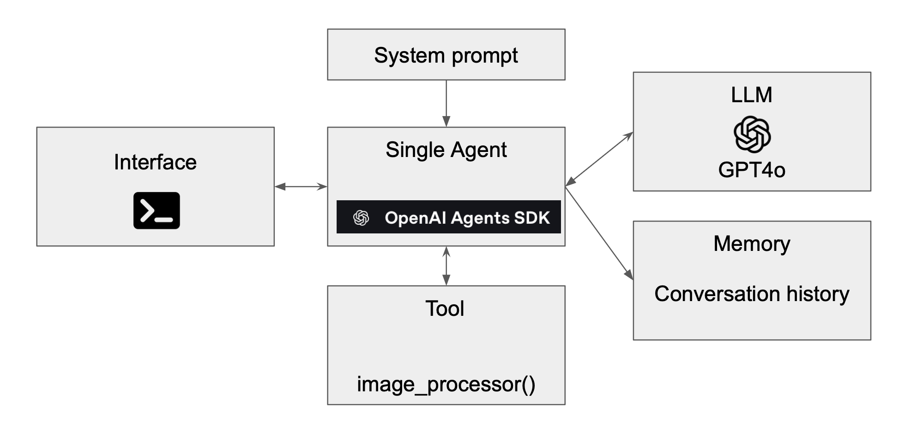
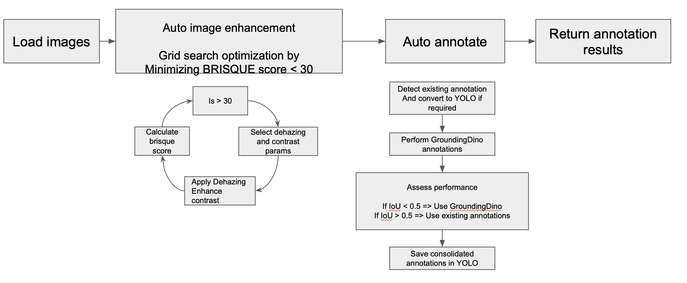

# Simple agentic Preprocessing pipeline using OpenAI Agents SDK

- The following repo implements a simple RPA pipeline using function calling and OpenAI Agents SDK
- The RPA pipeline performs standard image processing steps using openCV 

## Setup

```bash
conda create -n myenv python=3.11.11 && conda activate myenv && pip install -r requirements.txt
```

Enter your openai api key in .env.dev file like so 

```bash
OPENAI_KEY=INSERT_API_KEY
```

## Dataset

DAWN (Detection in Adverse Weather Nature) dataset consists of real-world images collected under various adverse weather conditions. This dataset emphasizes a diverse traffic environment (urban, highway and freeway) as well as a rich variety of traffic flow. The DAWN dataset comprises a collection of 1000 images from real-traffic environments, which are divided into four sets of weather conditions: fog, snow, rain and sandstorms. The dataset is annotated with object bounding boxes for autonomous driving and video surveillance scenarios. This data helps interpreting effects caused by the adverse weather conditions on the performance of vehicle detection systems. Also, it is required by researchers work in autonomous vehicles and intelligent visual traffic surveillance systems fields. All the rights of the DAWN dataset are reserved and commercial use/distribution of this database is strictly prohibited.

## System

Implement a simple single agent system to perform data preprocessing for image restoration on the given dataset above. 

The overall system is shown below : 



The image_processor() tool implements simple dehazing, denoising, constrast enhancements using openCV

